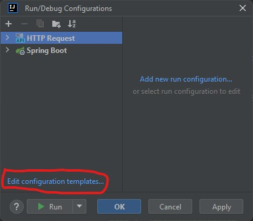
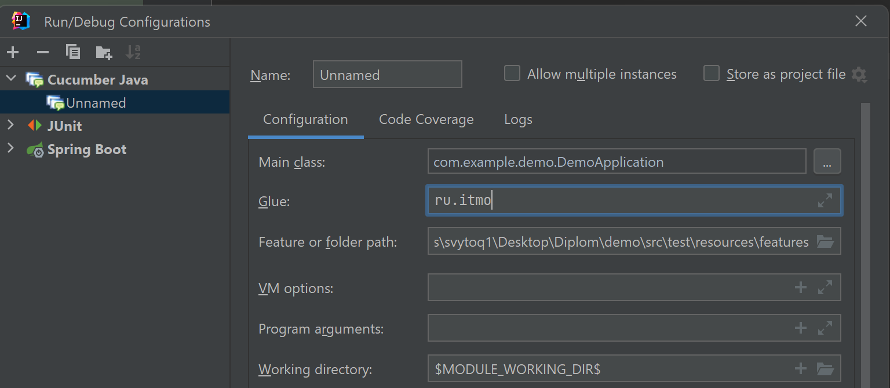

# Библиотека для тестирования Spring сервисов с использованием Cucumber

## Как подключить?
Maven: 
```bnf
...
<repositories>
        <repository>
            <id>jitpack.io</id>
            <url>https://jitpack.io</url>
        </repository>
</repositories>

<dependencies>
...
...
<dependency>
            <groupId>com.github.svytoq</groupId>
            <artifactId>cucumber-testing-utils</artifactId>
            <version>-d9c7e8a492-1</version> <!-- Актуальное версию можно посмотреть здесь https://jitpack.io/#svytoq/cucumber-testing-utils/-SNAPSHOT-->
        </dependency>
</dependencies>
...
```
# Что можно делать?
Библиотека включает в себя степы для тестирования Spring сервисов включая работу с HTTP, Postgresql, ApacheKafka, S3 

Используются тестовые контейнеры для запуска Postgresql, ApacheKafka, S3 что позвляет при необходимости включать тесты в pipeline.

Cucumber поднимает весь контекст приложения, что позволяет реализовывать полноценные системные тесты.

С помощью библиотеки можно тестировать: 
- HTTP (When) Имитация отправки различных сообщений юзером  
- HTTP (Then) Проверка ответа сервера 
- Postgres (Given) Очистка таблицы  
- Postgres (And) Ресет последовательности 
- Postgres (And) Обеспечить наличие сущности в таблице 
- Postgres (Then) Проверка наличия сущности в таблице 
- S3 (Given) Обеспечить наличие бакетов
- S3 (Given) Обеспечить наличие файлов в бакете
- S3 (Given) Обеспечить отсутствия файлов в бакете
- S3 (Then) Проверка появление файла
- Kafka (When) Имитация отправки сообщения в kafka топике с различными ключами и хедерами
- Kafka (Then) Проверка появления сообщения в kafka топике с различными хедерами и задержкой

Весь список Степов можно посмотреть в директориях steps каждого модуля

# Пример использования
Можно взять здесь: https://github.com/svytoq/demo

Для запуска потребуется:

src/test/java/com/example/demo/CucumberIntegrationTest.java:
```
@Suite
@IncludeEngines("cucumber")
@SelectClasspathResource("features")
@ExcludeTags("Ignore")
public class CucumberIntegrationTest {
}
```
src/test/java/com/example/demo/SpringIntegrationTest.java:
```
@CucumberContextConfiguration
@SpringBootTest(classes = DemoApplication.class, webEnvironment = SpringBootTest.WebEnvironment.DEFINED_PORT)
@EnableJpaRepositories(basePackages = "com.example.demo.repository")
@EntityScan(basePackages = "com.example.demo.model")
@Testcontainers
@ActiveProfiles("test")
public class SpringIntegrationTest {

    @Container
    private static final PostgreSQLContainer<?> POSTGRES = new PostgreSQLContainer<>("postgres:15-alpine")
            .withDatabaseName("testdb")
            .withUsername("testuser")
            .withPassword("testpass")
            .waitingFor(Wait.forListeningPort());

    @Container
    private static final KafkaContainer KAFKA = new KafkaContainer(DockerImageName.parse("confluentinc/cp-kafka:7.3.0"))
            .withEmbeddedZookeeper()
            .waitingFor(Wait.forListeningPort());

    @Container
    private static final MinIOContainer MINIO = new MinIOContainer("minio/minio:RELEASE.2023-09-04T19-57-37Z")
            .withExposedPorts(9000)
            .withUserName("minioadmin")
            .withPassword("minioadmin")
            .waitingFor(Wait.forListeningPort());

    @DynamicPropertySource
    static void registerProperties(DynamicPropertyRegistry registry) {
        startContainersIfNeeded();

        registry.add("spring.datasource.url", POSTGRES::getJdbcUrl);
        registry.add("spring.datasource.username", POSTGRES::getUsername);
        registry.add("spring.datasource.password", POSTGRES::getPassword);
        registry.add("spring.jpa.hibernate.ddl-auto", () -> "create-drop");

        registry.add("KAFKA_BOOTSTRAP_SERVERS", KAFKA::getBootstrapServers);
        registry.add("spring.kafka.bootstrap-servers", KAFKA::getBootstrapServers);

        registry.add("aws.s3.endpoint", () -> "http://localhost:" + MINIO.getFirstMappedPort());
        registry.add("aws.s3.access-key", () -> "minioadmin");
        registry.add("aws.s3.secret-key", () -> "minioadmin");
        registry.add("aws.s3.path-style-access", () -> "true");
    }

    private static synchronized void startContainersIfNeeded() {
        if (!POSTGRES.isRunning()) {
            POSTGRES.start();
        }
        if (!KAFKA.isRunning()) {
            KAFKA.start();
        }
        if (!MINIO.isRunning()) {
            MINIO.start();
        }
    }
}
```

src/test/resources/junit-platform.properties:
```
cucumber.glue=ru.itmo.integration,com.example.demo
```
После запятой второй пакет как в вашем приложении

Файл с тестовым сценарием, src/test/resources/features/1_Positive_scenario.feature:
```
#noinspection NonAsciiCharacters
Feature: 1_Positive_scenario

  Background:
    Given Kafka topic "demo.users" is clear
    And Db table "Users" is empty
    And Minio buckets exist
      | demo-users |
    And Minio buckets are empty
      | demo-users |

  Scenario: Сreate user John from http
    When User sends "POST" request with url "http://localhost:8080/api/users"
      """
     {
        "name": "John",
        "email": "john@example.com"
     }
      """
    Then Kafka topic "demo.users" receives message in 2000 millis
      """
      {
        "name": "John",
        "email": "john@example.com"
      }
      """
    And Db table "Users" has data:
      | id | name | email            |
      | 1  | John | john@example.com |
    And File "John_john@example.com.txt" exists in bucket "demo-users" in 5000 millis
```

Для запуска тестов через Intellij IDEA необходимо поменять шаблон для Cucumber конфигураций.

1. Удаляем все существующие Cucumber конфигурации
2. Переходим в окно редактирования шаблона
3. Добавляем путь для сканирования степов в поле Glue





Теперь новые конфигурации будут стартовать с этим путем

Запускаем, как обычно, через зеленую стрелочку в feature файле

Также можно запустить с помощью галочки рядом с CucumberIntegrationTest

Если надо использовать степы с возвращением ответа в HTTP, то надо реализовать https://github.com/svytoq/demo/blob/main/src/test/java/com/example/demo/builder/UserDataTableBuilder.java
и https://github.com/svytoq/demo/blob/main/src/test/java/com/example/demo/config/BuilderConfig.java

Если нужно использовать степы с слушателями кафки, нужно зарегестрировать слушателя как здесь(3 класса для каждого топика):https://github.com/svytoq/demo/tree/main/src/test/java/com/example/demo/kafka 
